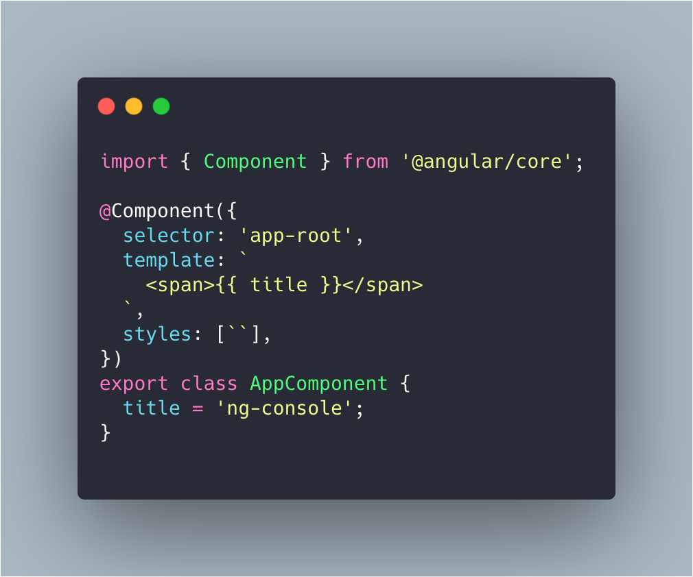

Com a versão 9 do Angular prestes a sair, temos algumas novas features que vão nos ajudar a desenvolver nossas aplicações e também a debugar-las de maneira certa, e uma dessas novidades é o objeto global `window.ng`.

## `window.ng`

Com o `window.ng` conseguimos ter acesso direto a Diretivas, Componentes entre outras features do Angular direto do console do browser, tudo isso com o Angular 9 e a nova api do [Ivy](https://angular.io/guide/ivy).

Para fazer nosso teste vamos precisar na última `RC` do Angular (9.0.0-rc.7 até o momento deste post). Vamos criar um novo projeto com Angular 9:


## Conhecendo a nova API do `window.ng`

Ok, com nosso projeto rodando vamos conhecer como que a api do `window.ng` funciona com alguns exemplos, o primeiro e o mais importante é o `ng.getComponent()`.



Com o nosso componente criado, vamos atualizar o valor do atributo `title` do nosso componente, para isso precisamos acessar o `HTMLElement ` do componente, para isso vamos usar a função do Chrome `$(selector)` e armazenar em uma variável, `el`. A função `ng.getComponent()` recebe um elemento, neste caso vamos usar o elemento que está armazenado na variável `el`, com isso já conseguimos atualizar o valor do atributo _title_ do nosso componente.

```js
// armazena o elemento em uma variável
const el = $('app-root');
// invoca a função getComponent() passando o elemento armazenado
const c = ng.getComponent(el);
// atualiza o valor do atributo title do componente
c.title = 'Hey new ng api!!!';
// invoca o change detector do Angular
ng.markDirty(el);
```

Exemplo:


### Casos de uso para o `ng.getComponent()`

- Acessar um service injetado no componente e disparar algum método do mesmo manualmente e acessar os valores via console;
- Fazer um subscribe em algum Observable e emitir o valor também no console;
- Acessar algum método do próprio componente e analisar se o comportamento está como esperado.

## `ng.markDirty()`

Você deve ter notado que no final do último exemplo usamos o método `markDirty()`. Essa função é importante ao debugar usando o console, ela é responsável por chamar a API de _change detector_ do Angular e fazer as devidas alterações no componente especificado, mais uma vez vamos usar o nosso exemplo:

```js
// armazena o elemento em uma variável
const el = $('app-root');
// invoca a função getComponent() passando o elemento armazenado
const c = ng.getComponent(el);
// atualiza o valor do atributo title do componente
c.title = 'Hey new ng api!!!';
// invoca o change detector do Angular
ng.markDirty(el);
```

Ao invocar o o `markDirty()` nos estamos dizendo ao Angular para atualizar o estado do componente, com isso podemos especificar uma instância de algum componente e acionar o _change detector_.

## Conclusão

Com a nova API vamos interagir rapidamente com os componentes e testar as coisas sem precisar ir e voltar entre o editor e o navegador, com isso novas extensões de desenvolvimento podem ser desenvolvidas sobre essas APIs para facilitar ainda mais nossa vida. 🥳
