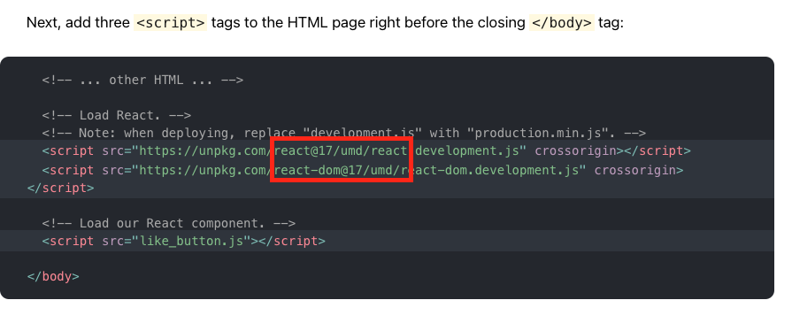

Já pensou em escrever um código JavaScript nos dias de hoje sem usar as sintaxes
_import/export_? Seria estranho, certo? Estamos acostumados a usar módulos no JavaScript,
mas em alguns momentos nos deparamos com as seguintes siglas: **AMD**, **CMJ**, **ESM**
ou **UMD**.



Sem mais delongas vamos ao que interessa, o que cada sigla dessas significa.

## Asynchronous Module Definition — AMD

Começando com o **AMD**, que é uma sigla para Asynchronous Module Definition, e é um padrão que foi proposto
para ser usado para aplicações frontend (enquanto o CJS — citado no próximo tópico,
é usado para códigos NodeJS). Segue um exemplo de código AMD:

```js
define(['dependecy01', ' dependency02'], function (dependecy01, dependecy02) {
  return function () {}
})
```

**Alguns detalhes do AMD:**

- Módulos AMD são importados de forma assíncrona;
- A sintaxe do AMD é menos intuitiva do que as demais (por exemplo o CJS);
- implementado pelo RequireJS;

**Mais informações sobre AMD**: _[Why AMD?](https://requirejs.org/docs/whyamd.html)_

## CommonJS — CJS

CJS é uma abreviação para CommonJS, um padrão usado no NodeJS. Em algum momento
já deve ter visto um trecho de código com a seguinte sintaxe:

```js
module.exports = function commonJsModule() {
  console.log('hello CJS!')
}

const commonJsModule = require('./cjsModule')
```

**Alguns detalhes sobre o CJS:**

- Imports do CommonJS são de forma síncrona;
- CommonJS não funciona no browser, temos que fazer um transpile para ter suporte;
- Quando importamos um módulo CJS, nós teremos uma cópia do objeto que foi importado;
- Não tem suporte a [tree shaking](/blog/2020-05-17-what-is-tree-shaking);

## ECMAScript Modules — ESM

ESM ou ES Modules trazem um padrão para o sistema de módulos do JavaScript e já
é suportado nas versões mais modernas dos atuais browsers. Provavelmente você já
se deparou com esta sintaxe:

```js
import {Component, Input } from '@angular/core';
.....

export const myValue = 123;
.....

export default function() {
  console.log('hey ESM');
}
```

A vantagem de termos um padrão é que a maioria das libs podem seguir este padrão
e aproveitar de suas vantagens, por exemplo o Rollup remover código desnecessário.

**Alguns detalhes sobre o ESM:**

- Suporte a [tree shaking](/blog/2020-05-17-what-is-tree-shaking)
- Sintaxe simples;
- Suporte nativo nos mais modernos navegadores;
- Pode ser usado direto no HTML:

```html
<script type="module">
  import React from 'react';

  React.createElement(....);
</script>
```

## Universal Module Definition — UMD

UMD é um padrão para o Universal Module Definition, e é um padrão capaz de funcionar
tanto no client-side quanto no server-side. A sintaxe não é das mais amigáveis,
mas une o melhor dos mundos do CJS e do AMD:

```js
(function (root, factory) {
    if (typeof define === "function" && define.amd) {
        define(["jquery"], factory);
    } else if (typeof exports === "object") {
        module.exports = factory(require("jquery"));
    } else {
        root.Requester = factory(root.$, root._);
    }
}(this, function ($, _) {
    // this is where I defined my module implementation

    var Requester = { // ... };

    return Requester;
}));
```

**Alguns detalhes sobre o UMD:**

- É uma combinação do CJS e do AMD;
- Funciona em ambos ambientes, front e back (daí o nome Universal);
- O UMD é usado como um fallback quando o build é feito pelo Webpack ou Rollup, por exemplo;

## Resumão

**AMD** é uma boa alternativa quando pensamos em módulos no frontend, além de ser
assíncrono;

**CJS** é usado no server side, tem uma sintaxe simples (usando require), não é possível
usar carregamento em runtime de módulos;

**ESM** é o melhor padrão devido a sua simplicidade, tem suporte a [tree shaking](/blog/2020-05-17-what-is-tree-shaking) e
uma sintaxe simples;

**UMD** é uma boa alternativa como fallback quando estamos usando ESM, pode ser usado
em ambos ambientes, AMD ou CJS, módulos UMD tem a capacidade de funcionar tanto no
client quando no server side.

Era isso, um bom resumo do que são essas siglas que vemos quando estamos trabalhando
com JavaScript ou em bibliotecas JS. Em breve mais um artigo da série Vocabulário do dev.
Até a próxima 🤙.

## Referências:

- https://requirejs.org/docs/whyamd.html
- https://developer.mozilla.org/en-US/docs/Web/JavaScript/Guide/Modules
- https://nodejs.org/docs/latest/api/modules.html
