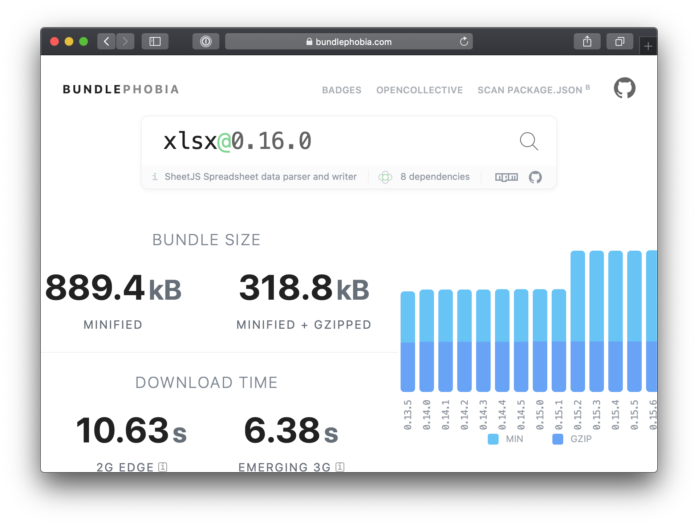

We are used to using modules in JavaScript (aka [esm](https://nodejs.org/api/esm.html))
since _ES6_ (or _ES2015_) ECMAScript modules are the official standard format for
packing JavaScript code for reuse. In applications with multiple modules it's constant
to have functions, methods, variables and many others pieces of code not used in our apps.

The _tree shaking_ term in the JavaScript world refers to dead-code elimination
from our application, the name became popular with _Rollup_ — an _ES2015_ module
bundler. Tree shaking is a technique that statically analyzes the code that is imported
from some module and during the bundle removes unused codes. This step is very
important when we are going to prepare a production build, generating smaller files.

Tools like **Webpack** or the **Rollup** mentioned above detect these codes that
are not being used in the application and remove them from the package generated.

## Nice, but what is actually considered a dead code?

This answer is simple, we will use the **Webpack** as _module bundle_ in our exemple,
it is the code that Webpack does not see you using around the application, it’ll
follow the trail of imports and exports throughout our app, if it finds any imported
module that does not being used in the module that imported it, the Webpack will
consider it as “dead code”.

Let’s see an example 😬

```typescript
// module-01.ts
export function sum(a: number, b: number): number {
  return a + b
}

export function minus(a: number, b: number): number {
  return a - b
}

// main-module.ts
import { sum, minus } from './module-01'

const main = () => {
  console.log(sum(2 + 2))
}

main()
```

In the example above, the function _minus_ was not executed in the code, just imported,
which means that, this will not be in our final bundle, the same happens with properties
of objects that are not used, see the example below:

```typescript
// person.ts
export const person = {
  name: 'Rai Siqueira',
  birthday: '2 december',
}

// main.ts
import { person } from './person'

console.log(person.name)
```

In the example above, the _birthday_ property is not accessed, so it will be removed
from our final bundle.

Tree shaking only works with _import_ and _export_ syntax, so it doesn’t work with
the syntax used in modules of the CommonJS type (using `require` syntax). The above
examples also apply to dependencies that we download from NPM, a practical example of
this is when using _Lodash_.

```typescript
import map from 'lodash/map'
```

The code snippet above will only add the Lodash `map` function to our build, not
Lodash entirely. Using the tree shaking technique and eliminating dead code can
significantly reduce the size of the code we have in our application.

Another technique that we can use is using the website BundlePhobia, which brings
several details of a package published in NPM, such as the subject of this
article - tree shaking.

Example of a package with tree shaking support (note the tree icon below the package name):


Example of a package without tree shaking support (without the tree icon below the package name):



We can improve the identification of dead code using lint tools, for example ESLint
or TSLint. I’ll indicate the **ESLint Plugin unused imports**
[eslint-plugin-unused-imports - npm](https://www.npmjs.com/package/eslint-plugin-unused-imports)
that will help you to identify unnecessary imports when you are coding.

Well, I hope I helped you to demystify this term that we hear a lot when we are
using modules in JavaScript.

---

_Did you find something wrong in the text? Click on the "**edit on GitHub**" link after
the references. This is my first text in English, all feedback is welcome._

_Referências:_

- https://developer.mozilla.org/en-US/docs/Glossary/Tree_shaking
- https://webpack.js.org/guides/tree-shaking/
- https://nodejs.org/api/esm.html#esm_introduction
- https://rollupjs.org/guide/en/
- https://bundlephobia.com
